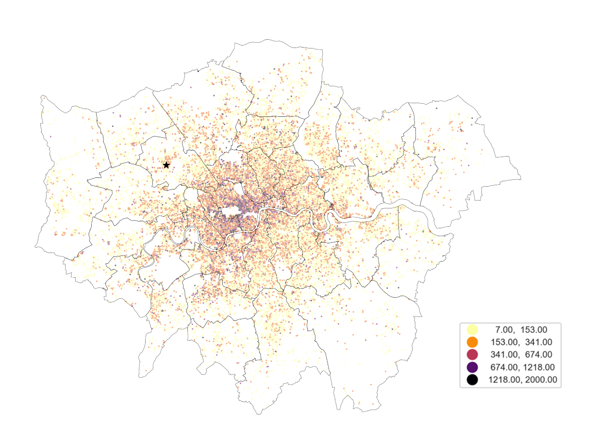

## Udacity Data Science Nanodegree

---
## Project 1: Writing a data scientist blog post 
The purpose of this project is to demonstrate the ability to effectively communicate technical results.

#### Created by: Juanita Smith
#### Last date: December 2023

---
 Airbnb - Secrets to find the best places to stay in London
---

Are you like me going to the Taylor Swift concert in London next June and looking for the best place to stay ?
London is an expensive city to visit with so much to offer. How to find accommodation with the best value for money, yet avoid wasting time and money on transport?

### Table of Contents

1. [Udacity Project requirements](#requirements)
2. [Installation](#installation)
3. [Project Motivation](#motivation)
4. [File Descriptions](#files)
5. [Data transformation](#transform)
6. [Results](#results)
7. [Licensing, Authors, and Acknowledgements](#licensing)

## 1. Udacity Project Requirements 

Overview of the main steps of this project, following the CRISP-DM process:

1. Come up with 3-5 questions I am interested in answering.
2. Extract the necessary data to answer these questions.
3. Perform necessary cleaning, analysis, and modeling.
4. Analyze, Model, and Visualize
5. Communicate business insights
   - Create a GitHub repository to share code and data wrangling/modeling techniques, with a technical audience in mind.
   - Create a blog post to share questions and insights with a non-technical audience.

## 2. Installation 

To clone the repository: https://github.com/JuanitaSmith/datascience_nanodegree.git

- Environment was build using Anaconda.
- Python 3.10 interpreter was used.
- Refer to `requirements.txt` for libraries and versions needed to build your environment.

- Use command `conda install -r requirements.txt` or `pip install -r requirements.txt` to rebuild the environment automatically.

- refer to `environment.yaml` for environment setup

## 3. Project Motivation

Since 2008, guests and hosts have used Airbnb to travel in a more unique, personalized way. 
As part of the Airbnb Inside initiative, open source data is available that describes the listing activity of homestays in London, United Kingdom.

For this project, I was most interested to predict the average base price per night for listings, but not so fast ! 
Before we jump into modelling, I first wanted to understand the main drivers that could cause potential price hikes and exceptions.

This project will focus on answering business questions below.  

1) Are some hosts running a business, and if so, what is the impact on price ?
  - Should we distinguish between short-term and long-term rentals, and how does it effect the daily average price ?
  - Are some hosts running a business with multiple listings ? If so, how does this affect the price ?

2) Host Analysis: How does **host excellence** influence price ?
  - Super hosts seems to describe their properties better, how does this effect price and availability ?

3) What effect does **star ratings** have on rental price ?
  - Would a 5-star vs 3-star listing in the same location cost more ?

4) Predict average daily listing price
  - Knowing the impact of business listings, host excellence and star ratings above, could we make an accurate average daily price prediction ?

#### The project is divided into 4 main notebooks:

- Notebook 1: Data wrangling with initial EDA to build business understanding, design the questions with all data wrangling steps to access and clean the data
- Notebook 2-4: Answers the 4 business questions described above
- Notebook 5: Optional extra spatial visualization showing London neighbourhoods and it's price differences to create visualization for blog post

Each of the notebooks is exploratory in searching through the data pertaining to the questions showcased by the notebook title.  
Markdown cells were used to assist in walking through the thought process for individual steps.  

## 4. File Descriptions 

London listing activity were downloaded from Airbnb [here](http://insideairbnb.com/get-the-data/). 
Scroll down to city **London**.
A snapshot of the data was taken from **8 June 2023.** to build and test the model
To download this exact version click on 'show archived data'

The following datasets were downloaded:

- **listings**: full descriptions of each rental property with average review score and daily average base price
- **calendar**: each listing have a record for each calendar day for the next 365 days ahead, showing the price and availability on that specific day
- **neighbourhoods.geojson**: Used to visualize spatial data in notebook 4 and 5

Metadata are available [here](https://docs.google.com/spreadsheets/d/1iWCNJcSutYqpULSQHlNyGInUvHg2BoUGoNRIGa6Szc4/edit#gid=1322284596)

As an option extra, data from timestamp 6 September 2023 was subsequently downloaded, which was cleaned up and used as final model evaluation step in notebook 4.

### **Important:** 
These raw files are not published to GitHub, as file size exceed 100MB and result in errors.
To rerun this project, simply download the files and add them to a `data/raw/` directory and update the file paths in the notebooks.

The cleaned data and models are however published in GitHub, you can find them under `data/clean` and `data/models`. You should be able to run notebooks 2-4 directly using these files.

## 5. Data transformation 

1) In notebook 1 during data wrangling, raw listing data is cleaned, outliers removed, obsolete/inactive listings are detected and removed, etc.
The cleaned file is stored in `data/clean/listing_clean.pkl` to preserve datatypes.

2) In notebook 2, whilst answering question if some listings are run by businesses, a new boolean feature was introduced 'is_business'.
Further outliers in average price was detected and removed.
Enriched listing dataset was stored in `data/clean/listing_enhanced.pkl`, and is used in remaining notebooks to answer questions 2-4.

## 6. Results

The main findings of the code can be found at the blog post available [here](https://medium.com/@juasmithy/secrets-to-find-the-best-places-to-stay-in-london-with-airbnb-1641c1b49e9b).

### Data cleaning

For a summary of cleaning activities performed, see summary at the bottom of notebook 1.
Overall, data needed a lot of correction. A special shoutout to issues 6 and 15.

6) There are around 12,000 listings in the dataset that seems inactive (not rented out anymore), causing a lot of missing values in rows. It happens where hosts were active in the past, had lots of reviews and then suddenly it stops. No reviews, no availability. Spot checking on Airbnb directly, it's not possible to book these listings.

15) Airbnb hosts can switch on smart pricing, you can read more about it [here](https://www.airbnb.co.uk/help/article/1168)

    It means prices are automatically increased, if demand increases due to world cups, concerts, etc.
    However, there listings in the calendar dataset where prices increase significantly from one day to the next, e.g. £100 one day, £24,000 the next, inflating the mean average price to abnormal levels.
    
    No model can predict such prices, therefore such entries were detected, adjusted and mean average price recalculated.

### Modelling results
Linear regression modelling was selected as the target variable, as average rental price per night, is a continues variable.
The target variable was converted to a log10 scale to be normally distributed, to meet the linear regression criteria.

A successful linear regression data science model using algorithm **'RidgeCV'** was build to predict prices with a median absolute error of only £11 per night. This means, prices are accurately predicted within a +/- £11 range. R2 score on the test dataset was 0.976, which means the model explains 98% of the variability of the data, which is totally amazing.
RidgeCV was chosen to minimize interactions introduced when adding features neighbourhood, room type and property type. We need a high level regularization with alpha at 3000 to obtain the low level of errors achieved.

To reduce model complexity, property type was summarized through clustering.
We have over 80 property types, which could make the model after one-hot encoding too complex and cause over fitting. 
We could use room type instead, but this has only 4 categories with so much variation in price, it's too simple for modelling. 
Room type, Property type, location coordinates (latitude, longitude) and price was used to cluster the properties into price groups.

**Gaussian mixture model (GMM)** algorithm was used for clustering, as it will look for clusters that have a normal price distribution within each cluster, which will provide a better split.

The average rental price in London does not easily exceed £500, however outliers up to £1500 was kept to observe model behaviour. 
These outliers can be removed for further improvement subsequently.
Generally, the model prediction up to £500 seems excellent if one observe the model performance actual vs predicted, residuals are perfectly linear up to +/£250 

As a last step, the model was evaluated with a new dataset with time stamp 06/09/2023, which became available subsequently. 
Outliers was not removed as during modelling, so the model has to cope with exceptional prices below £30 and above £1500.
Mean absolute error was a little higher at £16 and R2 score was 0.956, still a great result considering outliers was not removed.

## 7. Licensing, Authors, Acknowledgements

Must give credit to Airbnb for the data.  
You can find the Licensing for the data and other descriptive information at the Inside Airbnb  [here](http://insideairbnb.com/get-the-data/).  
This data is licensed under a Creative Commons Attribution 4.0 International License.