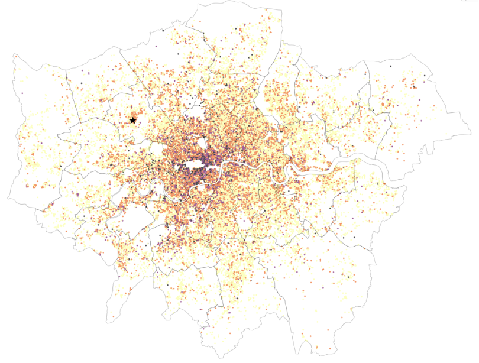

## Udacity Data Science Nanodegree

---
## Project 1: Writing a data scientist blog post 
The purpose of this project is to demonstrate the ability to effectively communicate technical results.

#### Created by: Juanita Smith
#### Last date: December 2023

---
 Airbnb - Secrets to find the best places to stay in London
---

Are you like me going the Taylor Swift concert in London next June and looking for the best place to stay ?
London is an expensive city to visit with so much to offer. How to find accommodation with the best value for money, yet avoid wasting time and money on transport?

### Table of Contents

1. [Udacity Project requirements](#requirements)
2. [Installation](#installation)
3. [Project Motivation](#motivation)
4. [File Descriptions](#files)
5. [Data transformation](#transform)
6. [Results](#results)
7. [Licensing, Authors, and Acknowledgements](#licensing)

## 1. Udacity Project Requirements 

Overview of the main steps of this project, following the CRISP-DM process:

1. Come up with 4 questions I am interested in answering.
2. Extract the necessary data to answer these questions.
3. Perform necessary cleaning, analysis, and modeling.
4. Evaluate results.
5. Share insights with stakeholders in a blog post.

## 2. Installation 

To clone the repository: https://github.com/JuanitaSmith/datascience_nanodegree.git

- Environment was build using Anaconda.
- Python 3.10 interpreter was used.
- Refer to `requirements.txt` for libraries and versions needed to build your environment.
- refer to `environment.yaml` for environment setup used

## 3. Project Motivation

Since 2008, guests and hosts have used Airbnb to travel in a more unique, personalized way. 
As part of the Airbnb Inside initiative, open source data is available that describes the listing activity of homestays in London, United Kingdom.

For this project, I was most interested to predict the average base price per night for listings, but not so fast ! 
Before we jump into modelling, I first wanted to understand the main drivers that could cause potential price hikes and exceptions.

This project will focus on answering questions below.  

1) Are some hosts running a business, and if so, what is the impact on price ?
>- Should we distinguish between short-term and long-term rentals, and how does it effect the daily average price ?
>- Are some hosts running a business with multiple listings ? If so, how does this affect the price ?

2) Host Analysis: How does **host excellence** influence price ?
>- Super hosts seems to describe their properties better, how does this effect price and availability ?

3) What effect does **star ratings** have on property price ?
>- Would a 5-star vs 3-star listing in the same location cost more ?

4) Predict average daily listing price
>- Knowing the impact of business listings, host excellence and star ratings above, could we make an accurate average daily price prediction ?

#### The project is divided into 5 notebooks:

- Notebook 1:EDA to build Initial data and business understanding with all data wrangling steps to clean-up the data
- Notebook 2-4: Answers the 4 business questions below
- Notebook 5: Optional extra spatial visualization showing London neighborhoods and it's price differentiation

Each of the notebooks is exploratory in searching through the data pertaining to the questions showcased by the notebook title.  
Markdown cells were used to assist in walking through the thought process for individual steps.  

## 4. File Descriptions 

London listing activity were downloaded from Airbnb [here](http://insideairbnb.com/get-the-data/). 
Scroll down to city **London**.
A snapshot of booking availability was taken as on **8 June 2023.**
To download this exact version click on 'show archived data'

The following datasets were downloaded:

- **listings**: full descriptions of each rental property with average review score and daily price
- **calendar**: each listing have a record for each calendar day for the next 365 days ahead, showing the price and availability on that specific day
- **neighbourhoods.geojson**: Used to visualize spatial data in notebook 4 and 5

Metadata are available [here](https://docs.google.com/spreadsheets/d/1iWCNJcSutYqpULSQHlNyGInUvHg2BoUGoNRIGa6Szc4/edit#gid=1322284596)

### **Important:** 
These raw files are not published to github, as file size exceed 100MB and result in errors.
To rerun this project, simply download the files and add them to a `data/raw/` directory and update the file paths in the notebooks.

## 5. Data transformation 

1) In notebook 1 during data wrangling, raw listing data is cleaned, outliers removed, obsolete listings are removed, etc.
The cleaned file is stored in `data/clean/listing_clean.pkl` to reserve datatypes.

2) In notebook 2, whilst answering question if some listings are run by businesses, a new boolean feature was introduced 'is_business'.
Further outliers in average price was detected and removed.
Enriched listing dataset was stored in `data/clean/listing_enhanced.pkl`, and is used in remaining notebooks to answer questions 2-4.

## 6. Results

The main findings of the code can be found at the post available [here]().

## 7. Licensing, Authors, Acknowledgements

Must give credit to Airbnb for the data.  
You can find the Licensing for the data and other descriptive information at the Inside Airbnb  [here](http://insideairbnb.com/get-the-data/).  
This data is licensed under a Creative Commons Attribution 4.0 International License.

